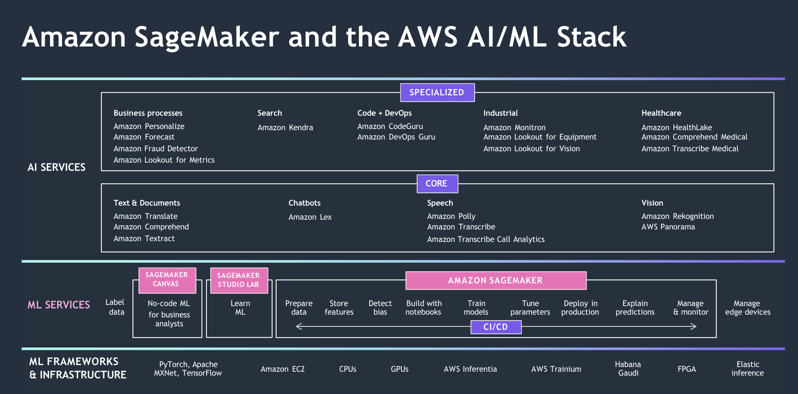
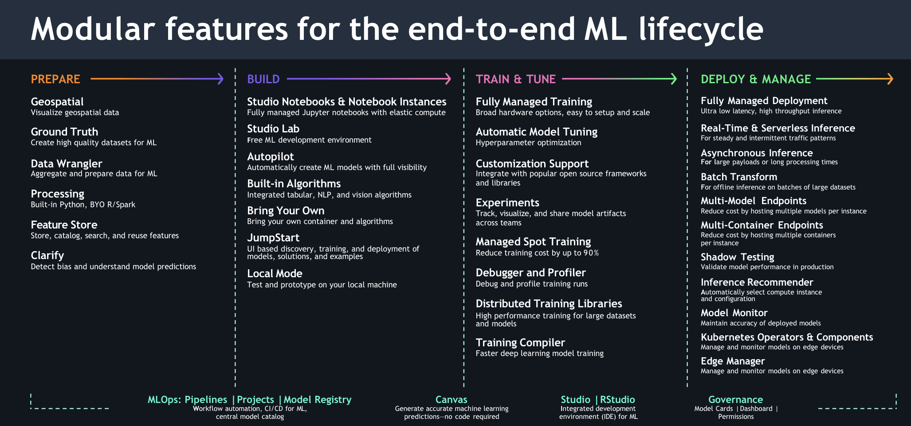

# MLOps Fundamentals

### Environments
1. Dev – can be accessed by people –no guarantee of quality – low risk
2. Stage - can be accessed by subset of people – test of dev code –
quality is matched with prod – treated as a live product
3. Prod – Very least number of people has access (tight control on
access) – Live Product –highest quality in assets – business critical

### Assets
- ML Project Code – Stored in Version Control Repository (Git)
- Models – Model & Model Artifacts with Model Registry
- Data – Separate environments for storage.
- Dev – Temporary
- Stage – Almost same as Prod – updates on frequent basis (Monthly, Quarterly, etc.)
- Prod – Reliable and Fres

### DEVOPS VS MLOPS

- Although DevOps and MLOps are well-
known terms among data and analytics
professionals, many business executives
do not fully grasp the magnitude of the
Machine Learning revolution sweeping
across industries, nor do they understand
the significance of these terms for their
organizations in effectively managing ML.
- As a result, many organizations struggle
to operationalize their ML efforts because
they mistakenly apply their well-
established DevOps principles to ML
without recognizing the differences and
the role these practices play within a
business strategy

### WHY DEVOPS IS NOT SUITABLE FOR MACHINE LEARNING

- While DevOps may be suitable for managing
conventional software development, it is not the
most optimal approach for the development and
operationalization of ML models.
- ML models possess the capability to learn from
data and make predictions or classifications
without explicit programming, leading to
significant advancements in fields like image
recognition, natural language processing, and
predictive analytics.
- The development and deployment of ML models
necessitate specialized infrastructure, efficient
data management, robust processing capabilities,
and expertise in specialized skills and knowledge
to ensure effective implementation
- ML development is characterized by its iterative and
experimental nature, distinguishing it from traditional software
development practices. and knowledge: ML requires
specialized skills and knowledge in areas such as data
engineering, data science, statistics, and math - and how to
apply these in the context of a business use case
- ML necessitates specialized skills and expertise in areas such as
data engineering, data science, statistics, and mathematics,
and their application within specific business use cases.
- ML models often demand specialized infrastructure and
resources, including GPUs, TPUs, distributed computing
systems, and tools for data storage and management.
- Once a model is developed, it must be effectively deployed and managed within a production environment
- Effective data management and
governance are crucial for the success
of ML development because ML
models heavily depend on extensive
data for training and making accurate
predictions. Therefore, ensuring
proper data management and
governance becomes paramount in
the ML development process

