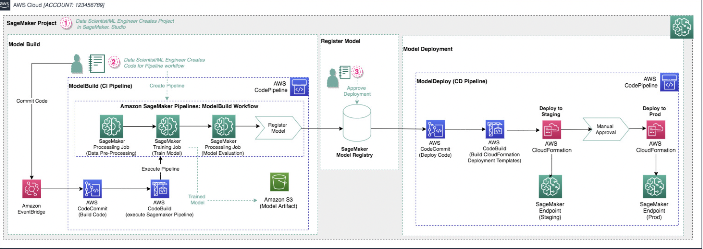

# MLOps Fundamentals

### Environments
1. Dev – can be accessed by people –no guarantee of quality – low risk
2. Stage - can be accessed by subset of people – test of dev code –
quality is matched with prod – treated as a live product
3. Prod – Very least number of people has access (tight control on
access) – Live Product –highest quality in assets – business critical

### Assets
- ML Project Code – Stored in Version Control Repository (Git)
- Models – Model & Model Artifacts with Model Registry
- Data – Separate environments for storage.
- Dev – Temporary
- Stage – Almost same as Prod – updates on frequent basis (Monthly, Quarterly, etc.)
- Prod – Reliable and Fres

