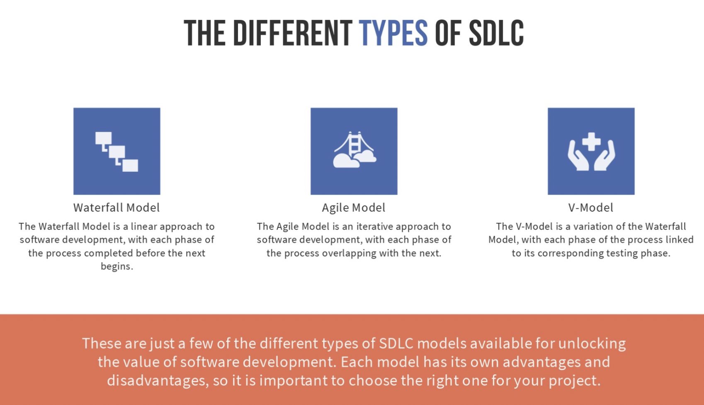

## Introduction to SDLC
Software Development Life Cycle (SDLC) is a process used by software development teams to plan, design, develop, test, and deploy applications. Understanding the SDLC process is essential for successful software development projects.

## Phases of SDLC
- Planning : Identifying the scope of the project and setting goals and objectives.
-  Coding Phase : System Design, static code analysis and code review.
-  Building Phase : Building the Software
-  Testing : Testing the application to ensure it meets requirements.
- Release Phase :Team Packaging, managing & deploying releases across various environments.
- Deployment : Deploying the application to production environment.
- Operate : Use of Software in the production Environment
- Monitor : Software, System, User Experience & Security are monitored.

## SDLC Models

Software Development Life Cycle (SDLC) methodologies provide a framework for managing the development of software projects. Among the most prevalent methodologies are Waterfall, Agile, and V-Model. Each approach has its own set of principles, practices, and advantages, catering to different project requirements and organizational preferences.

1. **Waterfall Model**:
   The Waterfall Model is one of the earliest SDLC methodologies and follows a sequential, linear approach to software development. It consists of distinct phases that flow downwards, similar to a waterfall, with each phase dependent on the deliverables of the previous one. The phases typically include:
   - **Requirements**: Gathering and documenting customer requirements.
   - **Design**: Creating a detailed design plan based on the gathered requirements.
   - **Implementation**: Developing the software based on the design specifications.
   - **Testing**: Verifying that the software meets the specified requirements.
   - **Deployment**: Releasing the software to users.
   - **Maintenance**: Providing ongoing support and updates.

   Advantages of the Waterfall Model include its simplicity, clarity, and ease of management. However, its rigidity can be a drawback, as changes in requirements or errors discovered late in the process can be costly to address.

2. **Agile Methodology**:
   Agile is an iterative and incremental approach to software development that emphasizes flexibility, collaboration, and customer feedback. Instead of rigidly following a predefined plan, Agile teams work in short cycles called iterations or sprints, typically lasting 1-4 weeks. Key principles of Agile include:
   - **Customer Collaboration**: Continuous involvement of the customer throughout the development process.
   - **Iterative Development**: Delivering working software in small increments, with each iteration building on the previous one.
   - **Adaptability**: Responding to change quickly and effectively, even late in the development process.
   - **Self-Organizing Teams**: Empowering teams to make decisions and adapt to challenges autonomously.

   Agile methodologies, such as Scrum and Kanban, promote transparency, rapid delivery, and customer satisfaction. They are particularly well-suited for projects with evolving requirements or where innovation and responsiveness are crucial.

3. **V-Model**:
   The V-Model, also known as the Verification and Validation Model, is an extension of the traditional Waterfall Model. It emphasizes the relationship between each development phase and its corresponding testing phase. The V-Model comprises a series of stages that mirror the phases of the Waterfall Model, with testing activities integrated at each step. The stages typically include:
   - **Requirements Analysis**: Defining and documenting system requirements.
   - **System Design**: Creating a high-level design based on the requirements.
   - **Architecture Design**: Developing a detailed system architecture.
   - **Module Design**: Designing individual software modules.
   - **Unit Testing**: Testing individual modules in isolation.
   - **Integration Testing**: Verifying that modules work together as intended.
   - **System Testing**: Testing the complete system against requirements.
   - **Acceptance Testing**: Confirming that the system meets user expectations.

   The V-Model promotes early testing and validation, reducing the likelihood of defects slipping through to later stages of development. However, like the Waterfall Model, it can struggle to accommodate changing requirements and may be less suitable for complex or rapidly evolving projects.

Each SDLC methodology has its own strengths and weaknesses, and the choice of approach often depends on factors such as project size, complexity, timeline, and organizational culture. While some projects may benefit from the structured approach of the Waterfall or V-Model, others may find Agile methodologies better suited to their needs due to their flexibility and adaptability.