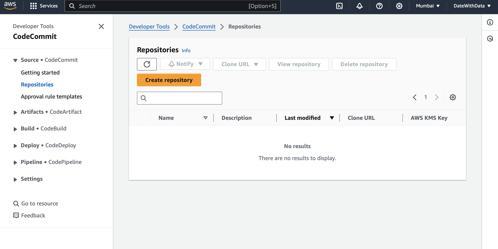

# AWS CodeCommit


AWS CodeCommit is a fully-managed source control service offered by Amazon Web Services (AWS). It provides a secure and scalable platform for hosting private Git repositories. With CodeCommit, development teams can collaborate on code, track changes, and manage versions of their software projects effectively.

Here are some key features and benefits of AWS CodeCommit:

1. **Private Git Repositories**: CodeCommit allows you to create private Git repositories to securely store your source code. This ensures that your code is accessible only to authorized users within your AWS account.

2. **Scalability and Performance**: Being a managed service, CodeCommit offers high scalability and performance. It can handle repositories of any size, from small projects to large enterprise-scale applications, without compromising on speed or reliability.

3. **Integration with AWS Services**: CodeCommit integrates seamlessly with other AWS services, such as AWS CodeBuild, AWS CodeDeploy, and AWS CodePipeline, enabling you to build, test, and deploy your applications automatically as part of your development workflow.

4. **Security and Compliance**: CodeCommit prioritizes security and compliance by providing encryption at rest and in transit for your repositories. It also supports AWS Identity and Access Management (IAM) for fine-grained access control, allowing you to manage user permissions and enforce security policies easily.

5. **Collaboration Tools**: CodeCommit includes collaboration tools such as pull requests, code reviews, and branch management, which facilitate collaboration among team members and help maintain code quality and consistency.

6. **Flexible Branching Strategies**: You can implement various branching strategies, such as feature branching, release branching, or GitFlow, to manage parallel development efforts and streamline the release process.

7. **Monitoring and Insights**: CodeCommit provides metrics and monitoring through AWS CloudWatch, allowing you to track repository activity, monitor performance, and gain insights into your development processes.

8. **Cost-Effective**: With CodeCommit, you only pay for the storage used by your repositories and any data transfer fees incurred. There are no upfront costs or long-term commitments, making it a cost-effective solution for version control.

Overall, AWS CodeCommit simplifies the process of managing and collaborating on source code, offering a secure, scalable, and reliable solution for software development teams building applications on AWS.

# CI/CD
Continuous Integration (CI), Continuous Delivery (CD), and Continuous Deployment (CD) are practices commonly used in modern software development to automate and streamline the process of building, testing, and deploying software.

1. **Continuous Integration (CI)**:
Continuous Integration is a development practice where developers frequently integrate their code changes into a shared repository, often multiple times a day. Each integration triggers an automated build process, during which the code is compiled, tested, and verified. The primary goal of CI is to detect and address integration errors early in the development cycle, ensuring that the software remains functional and stable as new changes are introduced. CI helps improve collaboration among team members, reduces integration problems, and accelerates the feedback loop, leading to faster development cycles and higher-quality software.

2. **Continuous Delivery (CD)**:
Continuous Delivery extends the principles of CI by automating the entire process of delivering software to production-like environments, where it can be tested and validated in a production-like environment. In a continuous delivery pipeline, code changes that pass the automated tests in the CI phase are automatically deployed to a staging or pre-production environment. This environment closely resembles the production environment and allows for further testing, user acceptance testing (UAT), and manual validation before the changes are promoted to production. Continuous Delivery enables teams to release software to customers quickly, reliably, and with minimal manual intervention, reducing the time and effort required to deliver new features and updates.

3. **Continuous Deployment (CD)**:
Continuous Deployment takes the concept of Continuous Delivery one step further by automating the deployment of every successful code change directly to production, without human intervention. In a continuous deployment setup, once the changes pass all automated tests and validations in the continuous delivery pipeline, they are automatically deployed to the production environment and made available to end-users. Continuous Deployment requires a high level of confidence in the automated testing and deployment processes, as any errors or issues in the code can potentially impact end-users immediately. It also promotes a culture of rapid experimentation and feedback, enabling teams to deliver value to customers more frequently and respond quickly to changing requirements or market conditions.

In summary, Continuous Integration focuses on integrating and testing code changes frequently, Continuous Delivery automates the process of delivering software to production-like environments for testing and validation, and Continuous Deployment automates the deployment of every successful code change directly to production, enabling teams to release software quickly, reliably, and with minimal manual effort.


## Code Commit
- AWS CodeCommit is a secure, highly scalable, managed
source control service that hosts private Git repositories.
It makes it easy for teams to securely collaborate on code with
contributions encrypted in transit and at rest.
- CodeCommit eliminates the need for you to manage your own
source control system or worry about scaling its infrastructure.
- We can use CodeCommit to store anything from code to
binaries.
- Supports the standard functionality of Git, so it works
seamlessly with your existing Git-based tools.

<hr>

```bash
git version
git config --global user.name "gaurav98094"
git config --global user.email "gaurav98094@gmail.com"
git config --global color.ui true
git config --global -l
git config --global core.autocrld true

git clone <https>

git init
git add .
git status
git log
git remote add origin <https>
git push -u origin master

git diff
git diff --staged
git status -v -v

git reset HEAD   #stage to work-dir
git reset --soft HEAD^  #commit to stage
git reset --hard HEAD^ #undo last commit and changes

git commit --amend -m "code commit" #soft_reset + commit

git revert <commit_id> #generate new commit id and revert changes
```

# Git Workflow
Git workflow refers to the process and conventions a team follows when using Git for version control. Here's a simplified breakdown:

1. **Clone**: Start by creating a local copy (clone) of the remote repository.
  
2. **Branch**: Work on a specific feature or fix by creating a new branch. This keeps changes isolated from the main codebase.

3. **Commit**: Make changes to files and commit them to the branch with descriptive messages.

4. **Push**: Share your commits by pushing them to the remote repository.

5. **Pull Request**: When ready, merge your branch into the main branch via a pull request. This allows for code review and discussion.

6. **Merge**: After approval, merge the changes into the main branch.

7. **Pull/Pull Fetch**: Regularly fetch and pull changes from the remote repository to stay up-to-date.

8. **Resolve Conflicts**: Address any conflicts that arise when merging branches.

9. **Deploy**: Deploy the changes to production, if applicable.

10. **Repeat**: Continuously iterate and improve the codebase by repeating the above steps for new features or fixes.

This workflow promotes collaboration, code review, and a systematic approach to managing changes in a project.