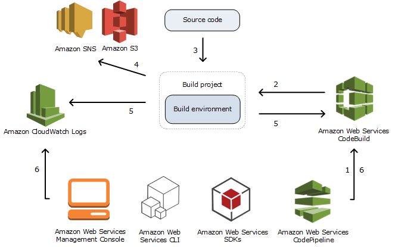

# AWS CodeBuild
AWS CodeBuild is a fully managed continuous integration service provided by Amazon Web Services (AWS). It allows developers to automate the build and test phases of their software release process. With CodeBuild, you can compile your source code, run unit tests, and produce deployable artifacts, such as executable files or Docker images.



Key features of AWS CodeBuild include:

1. **Fully Managed Service**: AWS CodeBuild is a fully managed service, which means AWS handles the infrastructure provisioning, scaling, and management, allowing developers to focus solely on their build and test processes.

2. **Build Environment Customization**: CodeBuild provides a wide range of build environment options, including pre-configured environments for popular programming languages and frameworks, as well as the ability to create custom environments tailored to specific project requirements.

3. **Integration with AWS Services**: CodeBuild seamlessly integrates with other AWS services such as Amazon S3, AWS CodeCommit, AWS CodePipeline, and AWS Lambda, enabling you to automate the entire software release workflow.

4. **Scalability**: CodeBuild automatically scales to handle build volumes, allowing you to run multiple builds concurrently without worrying about infrastructure provisioning or capacity constraints.

5. **Pay-as-You-Go Pricing**: With CodeBuild, you only pay for the compute resources you consume during the build process, based on the duration and size of your builds. There are no upfront fees or long-term commitments.

Overall, AWS CodeBuild simplifies the process of building, testing, and deploying applications by providing a scalable and flexible build service that integrates seamlessly with other AWS services.


### buildspec.yml
```yml
version: 0.2
env:
  variables:
    MY_AWS_REGION: "ap-south-1"
phases:
  install:
    runtime-versions:
      nodejs: 12
    commands:
      - echo "Running on $MY_AWS_REGION"
      - echo "Printing Env Variables"
      - printenv
      - echo "Start Install"
      - echo "Installation Complete"
  pre-build:
    commands:
      - echo "This is start of Pre-Build phase"
      - echo "Prebuild Phase is now complete"
  build:
    commands:
      - echo "we are currently on build phase"
      - echo "build activity is complete"
      - grep -Fq "AWS MLOps" index.html
      - echo "Test Was Sucessful"
      - echo "proceed to next step"
  post-build:
    commands:
      - echo "We are in post build phase"
      - echo "post build is completed"
artifacts:
  files:
    - '**/*'
```