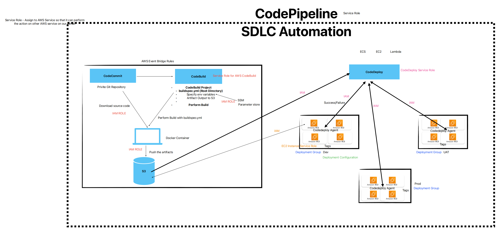

# AWS CodeDeploy
AWS CodeDeploy is a service provided by Amazon Web Services (AWS) that automates code deployments to any instance, including Amazon EC2 instances and instances running on-premises. It simplifies the process of releasing new features or updates to applications without disrupting the operation of existing services.



Here's how AWS CodeDeploy works:

1. **Deployment Configuration**: You define how you want your application to be deployed, including deployment groups, deployment type, and other settings. Deployment groups are collections of instances that you want to deploy your application to. These could be EC2 instances, on-premises servers, or instances in an auto-scaling group.

2. **Application Revision**: You upload your application code, along with the necessary files and configurations, to a revision repository such as Amazon S3 or GitHub.

3. **Deployment**: You create a deployment within CodeDeploy, specifying the deployment group and the revision you want to deploy. CodeDeploy then automatically pulls the specified revision from the repository and deploys it to the instances in the deployment group.

4. **Deployment Hooks and Lifecycles**: During the deployment process, you can specify lifecycle event hooks to customize how your application is deployed. These hooks allow you to run scripts or perform actions at different stages of the deployment process, such as before or after the deployment.

5. **Monitoring and Rollbacks**: AWS CodeDeploy provides monitoring capabilities, allowing you to track the progress of your deployments in real-time and view detailed logs and metrics. If any issues arise during the deployment, you can easily roll back to a previous version of your application with minimal downtime.

By using AWS CodeDeploy, you can automate and streamline your deployment process, making it faster, more reliable, and less error-prone. It also helps you achieve continuous delivery and integration practices, enabling you to release updates to your applications more frequently and efficiently.

# Relation Between Code-Commit, Build and Deploy

- AWS CodeCommit: Hosts Git repositories for source code management.
- AWS CodeBuild: Builds and tests code automatically.
- AWS CodeDeploy: Automates the deployment of code to various environments.

# AppSpec File
The `appspec.yml` file is a configuration file used in AWS CodeDeploy to specify how to deploy an application to a target environment. It defines the deployment lifecycle, including the files to be copied, the scripts to be executed, and the order of operations during deployment. 

Key components of the `appspec.yml` file include:

1. **Hooks**: Defines lifecycle event hooks, such as `BeforeInstall`, `AfterInstall`, `ApplicationStart`, etc., where you can specify scripts or commands to be executed at different stages of the deployment process.

2. **File section**: Specifies which files from your application should be deployed to specific locations on the target instances.

3. **Permissions**: Optionally, you can specify permissions for the files and directories being deployed.

4. **Variables**: Allows you to define environment-specific variables to be used during deployment.

Here's a minimal example of an `appspec.yml` file:

```yaml
version: 0.0
os: linux
files:
  - source: /
    destination: /var/www/html/myapp
hooks:
  BeforeInstall:
    - location: scripts/before_install.sh
      timeout: 300
      runas: root
  AfterInstall:
    - location: scripts/after_install.sh
      timeout: 300
      runas: root
```

In this example, files from the root directory of the application are deployed to `/var/www/html/myapp` on the target instance. Before and after installation, scripts `before_install.sh` and `after_install.sh` are executed respectively.


# Types of Deployment

In AWS CodeDeploy, there are two main types of deployment strategies: "In-Place" and "Blue/Green."

1. **In-Place Deployment**:
   - In an in-place deployment, the application is deployed to the existing instances or servers in the deployment group.
   - The deployment process involves stopping the current version of the application, deploying the new version, and then restarting the application.
   - This deployment strategy is typically used when downtime is acceptable or when resources are limited.

2. **Blue/Green Deployment**:
   - In a blue/green deployment, two identical environments, known as "blue" and "green," are maintained.
   - The current production environment (blue) continues to serve incoming traffic while the new version of the application is deployed to the "green" environment.
   - Once the deployment to the green environment is successful and verified, traffic is shifted from the blue environment to the green environment.
   - This strategy allows for zero-downtime deployments and provides a rollback mechanism in case of issues with the new version.
   
Each deployment type has its own advantages and use cases. In-place deployments are simpler to set up but may result in downtime during deployment, while blue/green deployments offer zero-downtime deployments at the cost of maintaining two sets of infrastructure. The choice between the two depends on factors such as application requirements, tolerance for downtime, and infrastructure complexity.